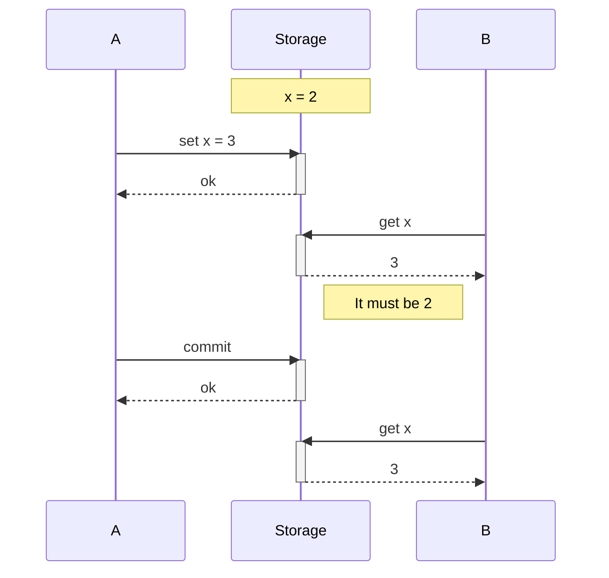
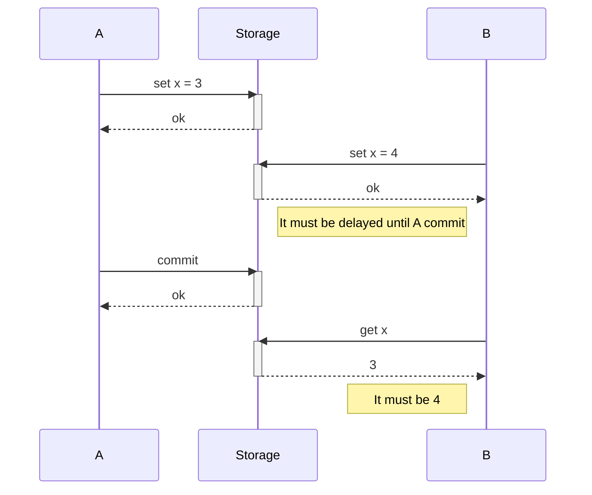
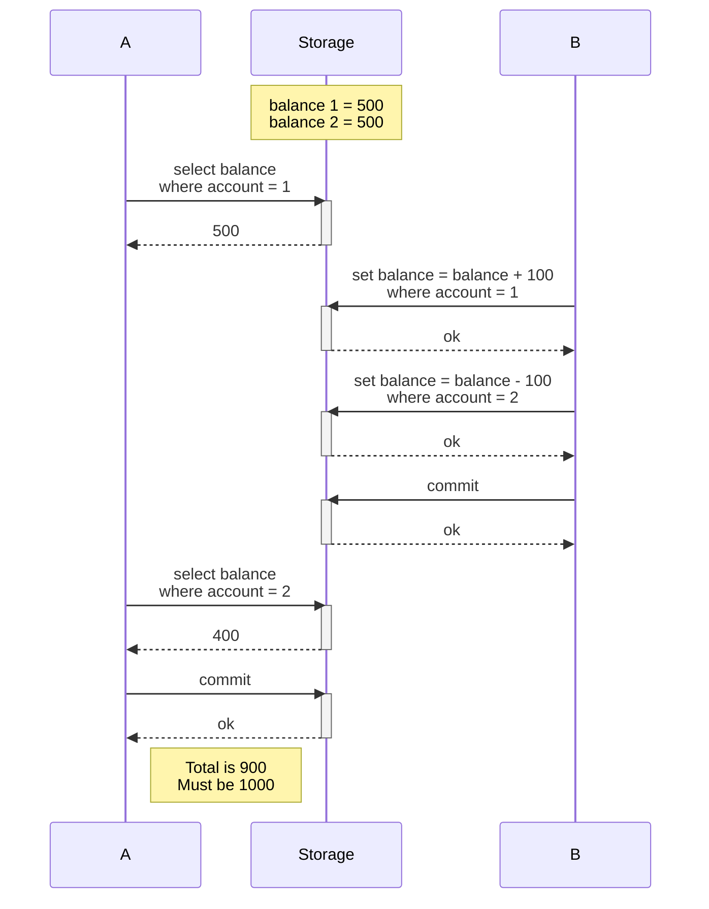

# AcidStore
A sample project to tackle ACID storage implementation problems.

# Problems
Given a storage that implement an interface:

```
interface IStorage
{
    void BeginTransaction();
    void Commit();
    void Abort();


    void Create(int id, object obj);    
    T GetAll();
    T Get(int id);
    void Update(int id, object obj);
    void Delete(int id);
}
```

Then make sure that concurrency problems such as Dirty reads/writes, read/write skew, lost update, and phantom reads can be resolved using transactions.

## Dirty reads



## Dirty writes



## Read skew (nonrepeatable read)

